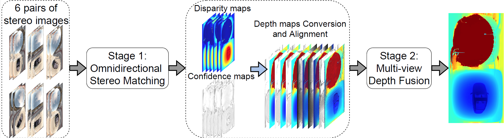

# MODE: Multi-view Omnidirectional Depth Estimation with 360$^\circ$ Cameras
This repository contains the source code for our paper:

[MODE: Multi-view Omnidirectional Depth Estimation with 360$^\circ$ Cameras. ECCV 2022](https://link.springer.com/chapter/10.1007/978-3-031-19827-4_12)


## Dataset Deep360
Deep360 is a large synthetic outdoor dataset for multi-view omnidirectional depth estimation. It contains 2100 frames for training, 300 frames for validation and 600 frames for testing. Panoramas, ground truth disparity and depth maps are presented to train and evaluate omnidirectional depth estimation algorithms. This dataset also contains "soiled version" of panoramas which are soiled or affected by three common outdoor factors: mud spots, water drops and glare.

You can download Deep360 through this [link](https://drive.google.com/drive/folders/1YJIaqDGWMTmGF0tyW8ktfG26xk-jSntg?usp=sharing). This folder contains 6 zip files corresponding to 6 episodes of Deep360, and a Readme.txt file for the introduction.

You can use following MD5 checksums to check these files. The check sums are computed as described in RFC 1321. 
```
ep1_500frames.zip : 77b93fe5aa01c1c5cf367c033c2d3f68
ep2_500frames.zip : 3bb4e70a381edbf71c8e84bc0c0cb943
ep3_500frames.zip : b2be6d4e03ea73e1979e198d94edb893
ep4_500frames.zip : 648b093022e3e17f35bab1d191754b89
ep5_500frames.zip : bc1acd148ae8d286420ac5e695de900c
ep6_500frames.zip : ac3a763b31d1bd73989a8c428d505438
README.txt : 4932221f7be68c69dd6a88dc0e9658bb
```
The file structure of Deep360 is as follow:
```
Deep360
├── README.txt
├── ep1_500frames
    │ ├── training
    │   ├── rgb
    │   ├── rgb_soiled
    │   ├── disp
    │   ├── depth
    │ ├── validation
    │ ├── testing
├── ep2_500frames
├── ep3_500frames
├── ep4_500frames
├── ep5_500frames
├── ep6_500frames
```
Please download and unzip the file, and follow the README.txt in the dataset folder and the dataloader in this repository to use this dataset.
## Introduction
MODE is a two-stage omnidirectional depth estimation framework with multi-view 360◦ cameras. The framework first estimates the depth maps from different camera pairs via omnidirectional stereo matching and then fuses the depth maps to achieve robustness against mud spots, water drops on camera lenses, and glare caused by intense light.



This [video](https://www.youtube.com/watch?v=Fw-KR35UWgQ) shows the process of generating the Deep360 dataset and the results of MODE on real scenes.

## Requirements
+ gcc/g++ <=7.5.0 (to compile the sphere convolution operator)
+ PyTorch >=1.5.0
+ tensorboardX
+ cv2
+ numpy
+ PIL
+ numba
+ prettytable (to show the error metrics)
+ tqdm (to visualize the progress bar)
## Usage
* **First you need to compile the Spherical Convolution operator with following bash command:**
```
cd models/basic/spherical_conv && bash ./build.sh && cd ../../../
```
* **Training the disparity estimation stage(stereo matching)**

you can train the model with the same protocol in this paper (w.r.t load the pretrained stack hourglass part of PSMNet) using this command:
```
python train_disparity.py --dataset_root [path to Deep360 folder] --checkpoint_disp [path to pretrained PSMNet ckpt] --loadSHGonly --parallel
```
or train it from the random initialization:
```
python train_disparity --dataset_root [path to Deep360 folder] --parallel
```

* **Testing the disparity estimation stage(stereo matching)**

please run 
```
python test_disparity.py --dataset_root [path to Deep360 folder] --checkpoint_disp [path to trained ckpt of disparity stage] --parallel --save_output_path [path to save output]
```
for testing.

* **Saving outputs of stereo matching stage**

We suggest storge the disparity maps and confidence maps of stereo matching stage before the fusion stage to save the training time. 
please run 
```
python save_output_disparity_stage.py --checkpoint_disp [path to trained ckpt of disparity stage] --datapath [path to Deep360 folder] --outpath [path to save predicted disparity and confidence maps]
```
* **Training the fusion stage**

please run following command to train the fusion model:
```
python train_fusion.py --datapath-dataset [path to Deep360 folder] --datapath-input [path to saved outputs of disparity stage]
```
* **Testing the fusion stage**

please run following command to test the fusion model:
```
python test_fusion.py --datapath-dataset [path to Deep360 folder] --datapath-input [path to saved outputs of disparity stage] --outpath [path to save the fusion results]
```


*For all the command above, add ```--soiled``` for the soiled version of Deep360.*
## Pretrained Models
Our pre-trained models can be found:

[ModeDisparity](https://drive.google.com/file/d/1ltQ4A-XoMNLXANt7sITYxD4Jx_TGBXiW/view?usp=sharing)

[ModeFusion](https://drive.google.com/file/d/1qGDD4kVx6KwVsxEqxfQu_BREVN9Ha2DC/view?usp=sharing)

[ModeFusion_soiled](https://drive.google.com/file/d/1hUzMTl61ODUr7Dg5u58AdtW0A9ZPGcKn/view?usp=sharing)

## Acknowledgements
The sperical convolution in this paper refers to Coors et al.[1].

The code of stack hourglass in stereo matching network is adapted from [PSMNet](https://github.com/JiaRenChang/PSMNet) [2].

## Citation
If you use the Deep360 dataset, or find this project and paper helpful in your research, please cite our paper.
(The citaion could be slightly different when this paper is published formally. We will update it in time.)
```
@inproceedings{Li_Jin2022MODE,
  author       = "Li, Ming and Jin, Xueqian and Hu, Xuejiao and Dai, Jingzhao and Du, Sidan and Li, Yang",
  title        = "MODE: Multi-view Omnidirectional Depth Estimation with 360$^\circ$ Cameras",
  booktitle    = "European Conference on Computer Vision (ECCV)",
  month        = "October",
  year         = "2022"
}
```

## References
[1] Coors, B., Condurache, A.P., Geiger, A.: Spherenet: Learning spherical representations for detection and classification in omnidirectional images. In: Ferrari, V.,Hebert, M., Sminchisescu, C., Weiss, Y. (eds.) Computer Vision – ECCV 2018. pp.525–541. Springer International Publishing, Cham(2018)

[2] Chang, J., Chen, Y.: Pyramid stereo matching network. In: 2018 IEEE/CVF Conference on Computer Vision and Pattern Recognition. pp. 5410–5418 (2018). https://doi.org/10.1109/CVPR.2018.0
